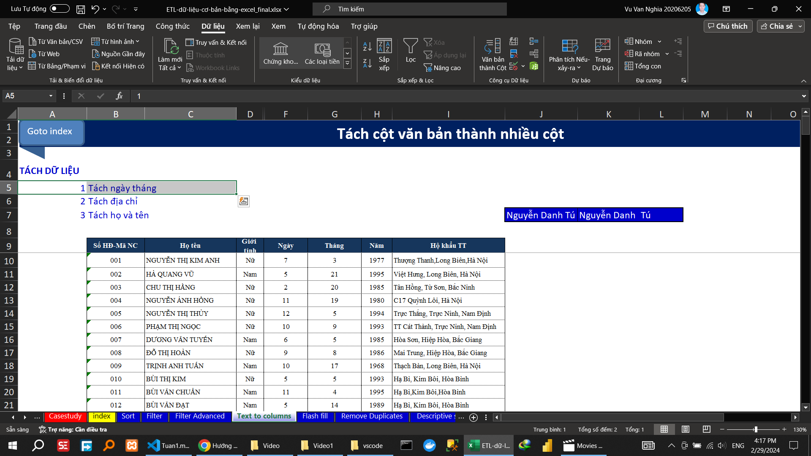

\subsection{Video 7}
<!-- Hướng dẫn     định dạng top % -->
		
<!-- Hướng dẫn     định dạng tiến độ -->

<!-- Hướng dẫn     định dạng điều kiện số -->

<!-- Hướng dẫn     định dạng bảng -->

<!-- Hướng dẫn     định dạng ô -->

<!-- Hướng dẫn     định dạng lọc trùng -->

<!-- Hướng dẫn      xóa định dạng có điều kiện -->

			
<!-- Hướng dẫn   quản lý các định dạng -->
 

\subsection{Video 8}

Hướng dẫn
