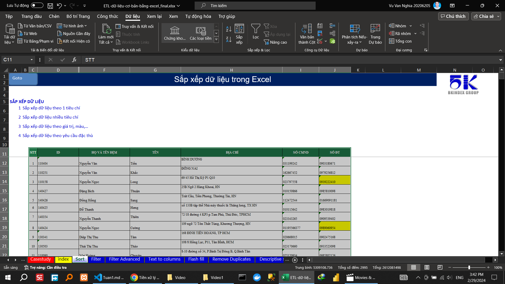
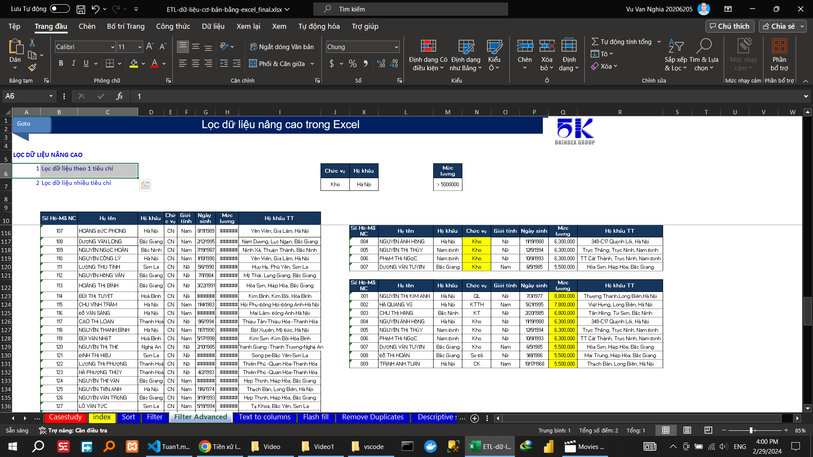
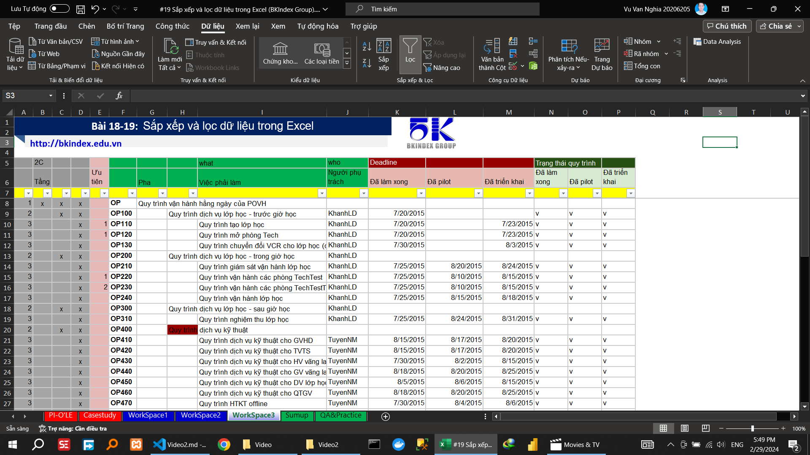

# Tuần 1: Thực hành tiền xử lý dữ liệu (ETL) cơ bản trong Excel:

## Video 1

### SẮP XẾP DỮ LIỆU

#### Sắp xếp dữ liệu theo 1 tiêu chí

#### Sắp xếp dữ liệu nhiều tiêu chí

#### Sắp xếp dữ liệu theo giá trị, màu,…

<!-- #### Sắp xếp dữ liệu theo yêu cầu đặc thù -->

### LỌC DỮ LIỆU

#### Lọc dữ liệu theo 1 tiêu chí

#### Lọc xếp dữ liệu nhiều tiêu chí

### LỌC DỮ LIỆU NÂNG CAO

#### Lọc dữ liệu theo 1 tiêu chí

#### Lọc xếp dữ liệu nhiều tiêu chí

### TÁCH CỘT VĂN BẢN THÀNH NHIỀU CỘT

#### Tách ngày tháng

#### Tách địa chỉ

#### Tách họ và tên

### ĐIỀN DỮ LIỆU TỰ ĐỘNG

### XÓA DỮ LIỆU BỊ TRÙNG

### THỐNG KÊ MÔ TẢ

## Video2

## Video3

## Video4

## Video5

## Video6

## Video7

## Video8
