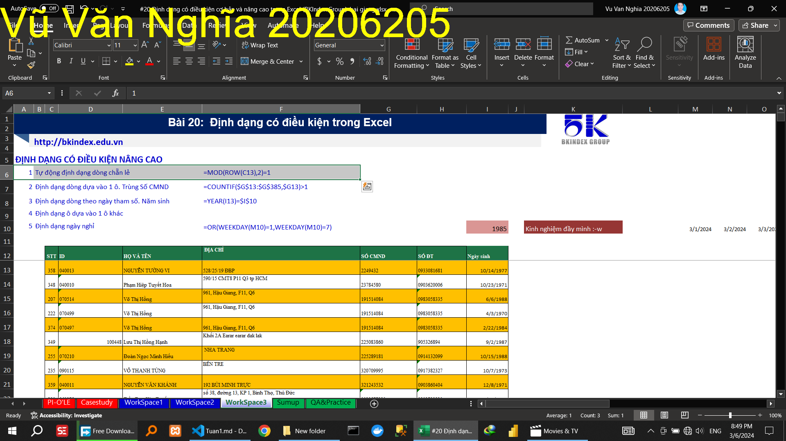
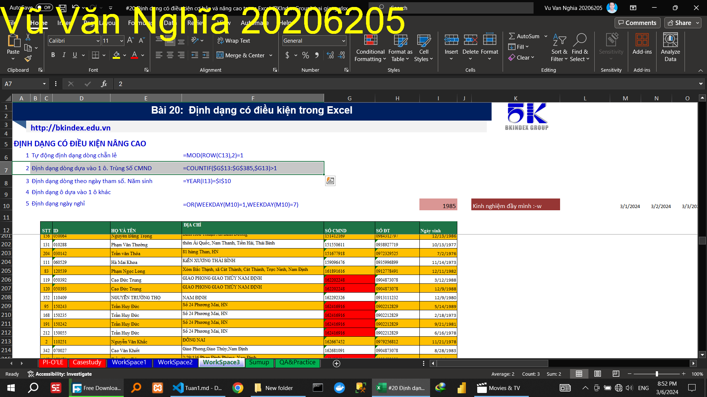
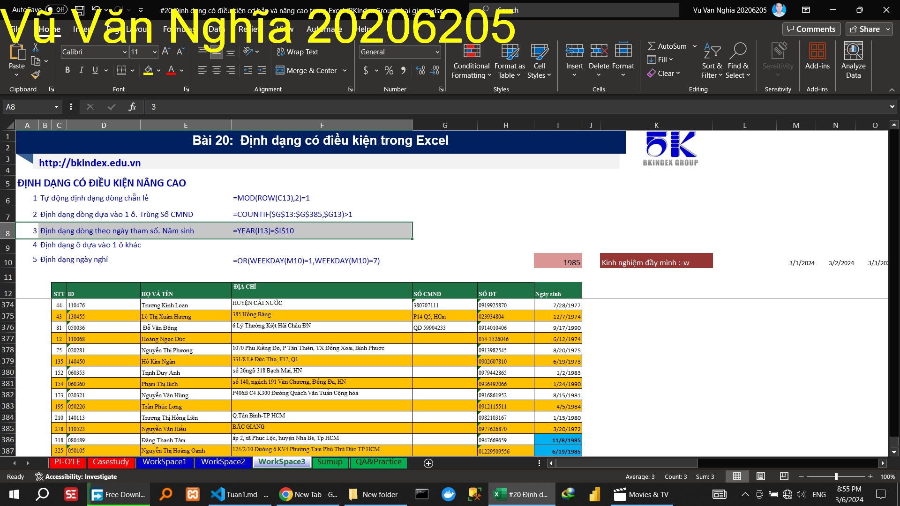
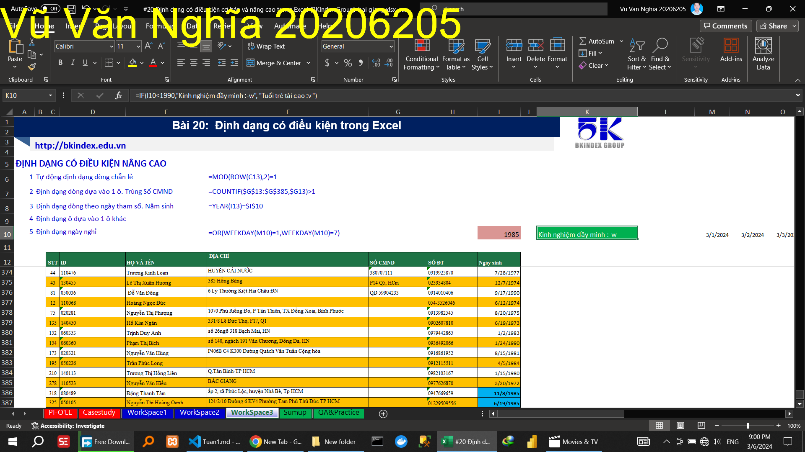
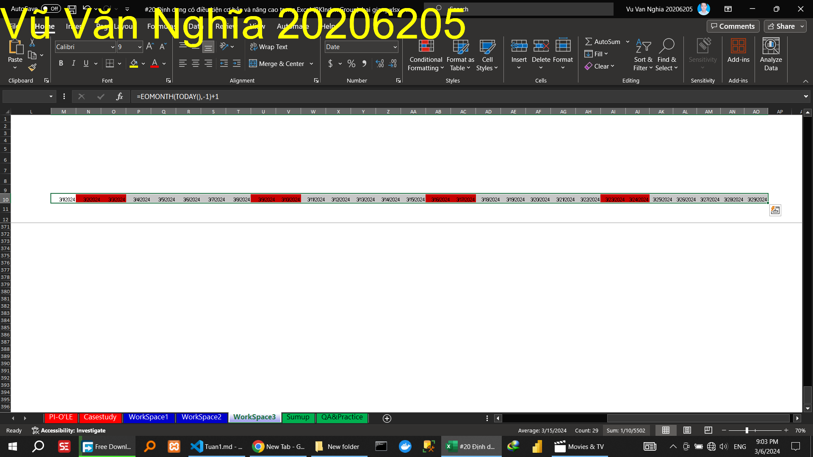

<!-- Hướng dẫn    tự động định dạng dòng chẵn lẻ -->

<!-- Hướng dẫn    định dạng dòng dựa vào 1 ô (trùng số CMND) -->

 

<!-- Hướng dẫn    định dạng dòng theo ngày tham số  (Năm sinh) -->

<!-- Hướng dẫn    định dạng ô dựa vào 1 ô khác -->

<!-- Hướng dẫn    định dạng ngày nghỉ -->
