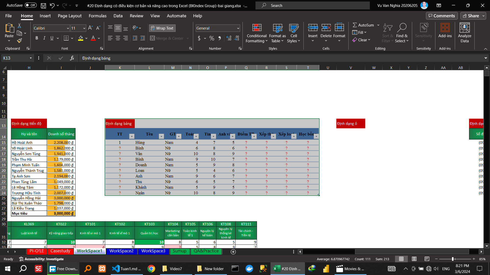

<!-- \subsection{Video 6} -->
<!-- Hướng dẫn kiểm tra hợp lệ dữ liệu dạng danh sách đồ ăn, đồ uống 		 -->

<!-- Hướng dẫn kiểm tra hợp lệ dữ liệu dạng  điều kiện	lớn hơn 0 		 -->

<!-- Hướng dẫn  thông báo nhập phải nhập số lớn hơn 0	 -->

<!-- Hướng dẫn  thông báo lỗi phải nhập số lớn hơn 0	 -->

<!-- Hướng dẫn  thông báo lỗi phải nhập số lớn hơn 0	 -->
        Danh sách nâng cao		
                

<!-- Trong video này, Bạn sẽ học Excel sử dụng: -->
<!-- - Kiểm tra hợp lệ dữ liệu dạng chọn combox (combox data validation excel) -->
<!-- - Kiểm tra hợp lệ dữ liệu tùy chỉnh (custom data validation excel) -->
<!-- - HIện thông báo khi nhập dữ liệu vào ô kiểm tra dữ liệu (Input message data validation excel) -->
<!-- - Hiện thông báo sau khi nhập vào ô kiểm tra dữ liệu (Output message data validation excel) -->
<!-- - Sử dụng hàm indirect để làm combox tùy chỉnh (indirect excel) -->
<!-- - Data Validation trong Excel -->
<!-- - data validation -->
<!-- - chuc nang data valdiation trong excel -->
<!-- - tạo drop down list -->
<!-- - hướng dẫn sử dụng data validation -->
<!-- - cach su dung data validation -->
<!-- - data validation có chức năng gì -->
<!-- - data validation dùng thế nào -->
\subsection{Video 7}

\subsection{Video 8}

Hướng dẫn
