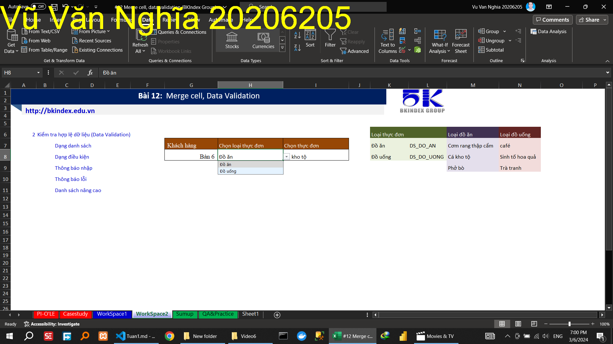
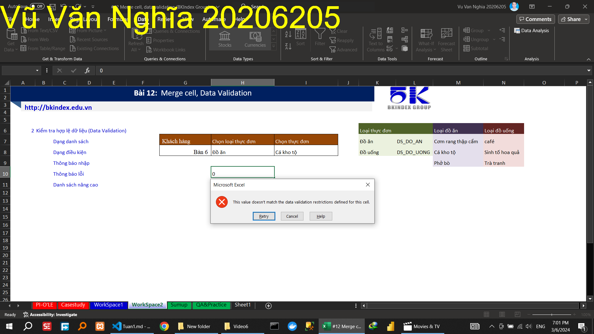
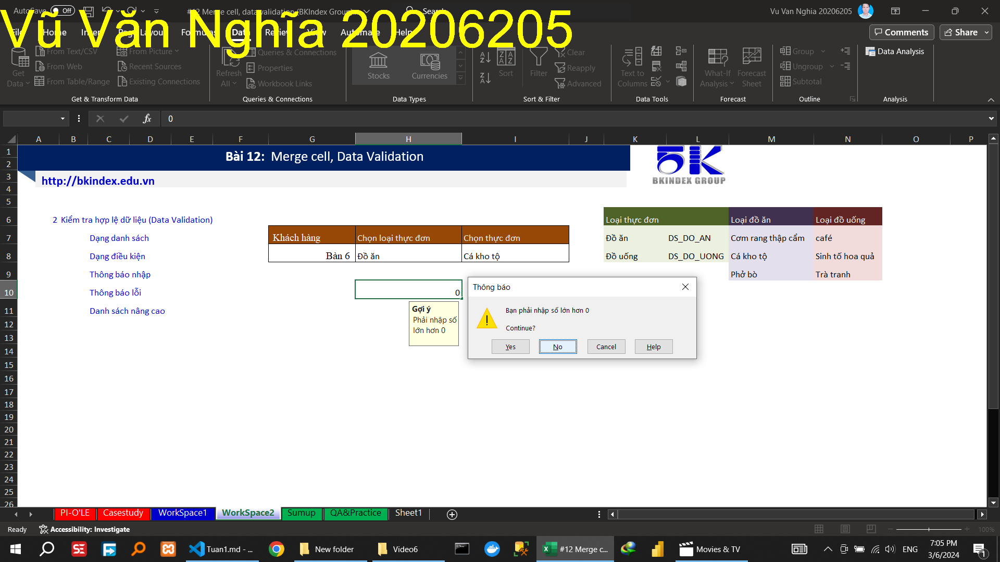
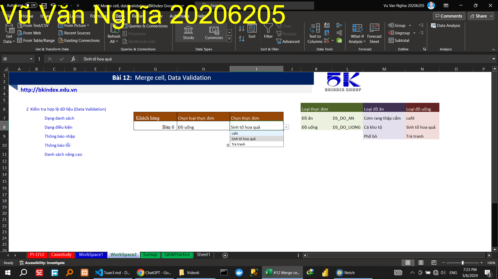

<!-- \subsection{Video 6} -->
<!-- Hướng dẫn kiểm tra hợp lệ dữ liệu dạng danh sách chọn đồ ăn, đồ uống 		 -->

<!-- Hướng dẫn kiểm tra hợp lệ dữ liệu dạng   tùy chỉnh   điều kiện	lớn hơn 0 		 -->

<!-- Hướng dẫn hiện   thông báo nhập phải nhập số lớn hơn 0	 -->

<!-- Hướng dẫn hiện   thông báo lỗi phải nhập số lớn hơn 0	 -->

<!-- Hướng dẫn  sử dụng hàm indirect   làm danh sách nâng cao		đồ ăn, đồ uống 		 -->
 

 
\subsection{Video 7}

\subsection{Video 8}

Hướng dẫn
