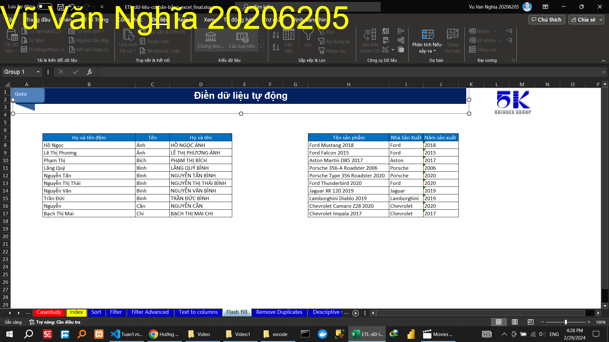
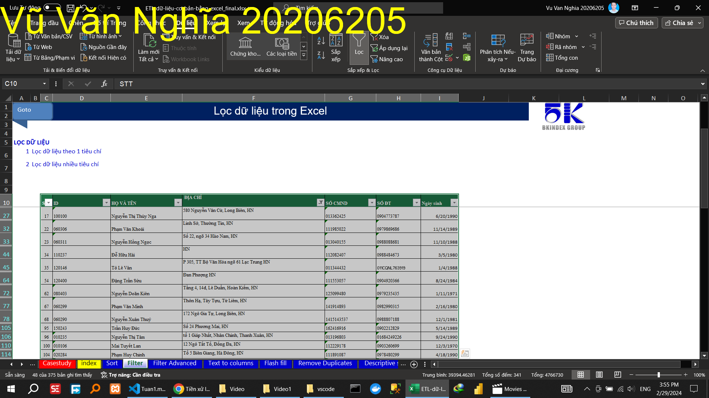
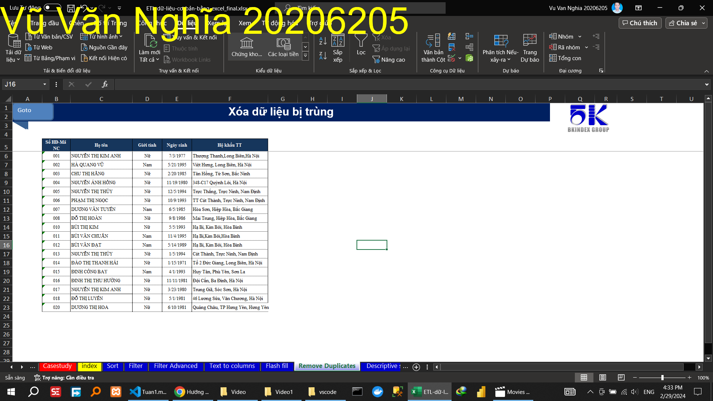

<!-- HuongDan -->
<!-- ThucHanh -->
# Tuần 1: Thực hành tiền xử lý dữ liệu (ETL) cơ bản trong Excel:

## Video 1

### Hướng dẫn

#### SẮP XẾP DỮ LIỆU

##### Sắp xếp dữ liệu theo 1 tiêu chí

##### Sắp xếp dữ liệu nhiều tiêu chí

##### Sắp xếp dữ liệu theo giá trị, màu,…

<!-- ##### Sắp xếp dữ liệu theo yêu cầu đặc thù -->

#### LỌC DỮ LIỆU

##### Lọc dữ liệu theo 1 tiêu chí

##### Lọc xếp dữ liệu nhiều tiêu chí

#### LỌC DỮ LIỆU NÂNG CAO

##### Lọc dữ liệu theo 1 tiêu chí

##### Lọc xếp dữ liệu nhiều tiêu chí

#### TÁCH CỘT VĂN BẢN THÀNH NHIỀU CỘT

##### Tách ngày tháng

##### Tách địa chỉ

##### Tách họ và tên

#### ĐIỀN DỮ LIỆU TỰ ĐỘNG

#### XÓA DỮ LIỆU BỊ TRÙNG

#### THỐNG KÊ MÔ TẢ

### Thực hành
<!-- "Bỏ vùng trộn (merge) Đóng băng tiêu đề dữ liệu" -->
- Tách họ và tên bằng các cách khác nhau (công thức, flash fill,..)					
- Sắp xếp danh sách theo Tên nhân công					
- Lập danh các chức vụ của mỗi bộ phận ( Remove Duplicates)					
                    

## Video 2

## Video 3

## Video 4

## Video 5

## Video 6

## Video 7

## Video 8
