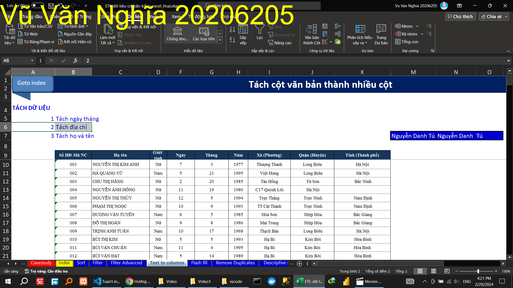
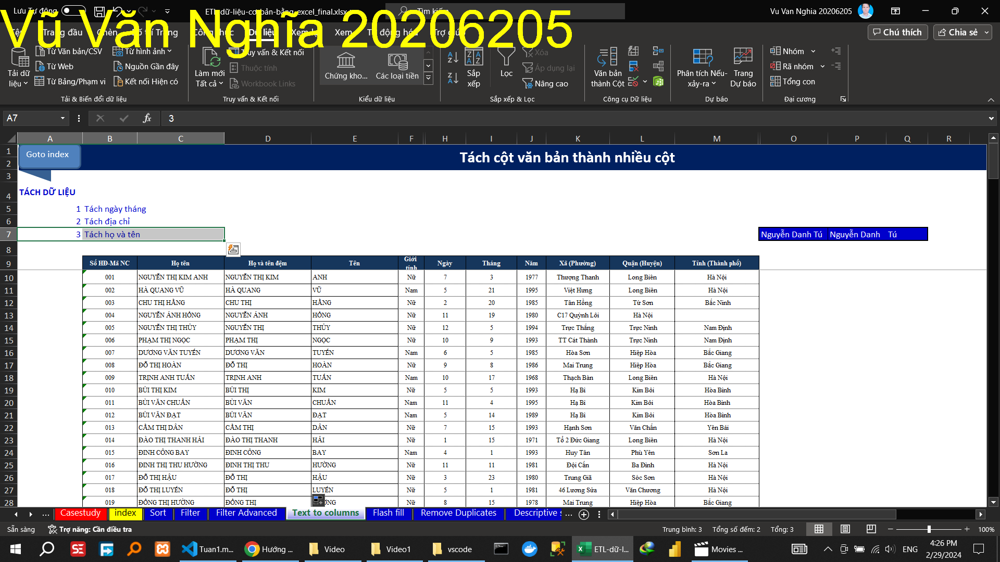

 

#### TÁCH CỘT VĂN BẢN THÀNH NHIỀU CỘT

##### Tách ngày tháng

##### Tách địa chỉ

##### Tách họ và tên

<!--  -->
#### ĐIỀN DỮ LIỆU TỰ ĐỘNG

#### XÓA DỮ LIỆU BỊ TRÙNG

#### THỐNG KÊ MÔ TẢ

### Thực hành

<!-- "Bỏ vùng trộn (merge) -->

<!-- Đóng băng tiêu đề dữ liệu" -->

<!-- Tách họ và tên bằng    công thức -->

<!-- Tách họ và tên bằng    flash fill -->

<!-- Sắp xếp danh sách theo tên nhân công -->

<!-- Lập danh các chức vụ của mỗi bộ phận ( Remove Duplicates) -->

