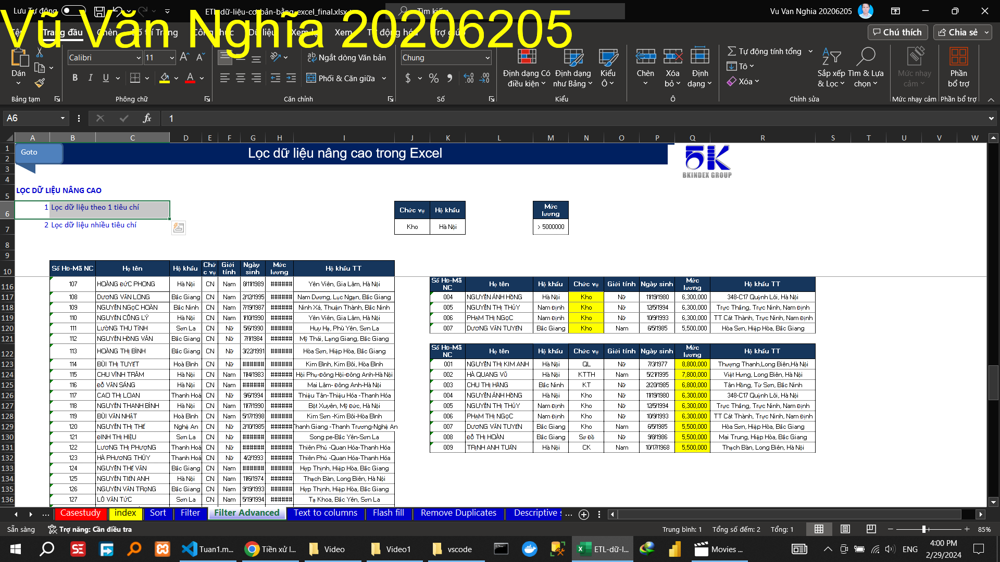
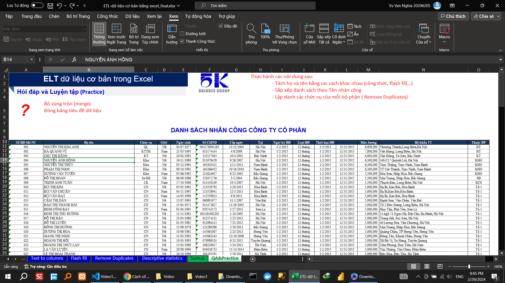

## Video 1

### Hướng dẫn
#### SẮP XẾP DỮ LIỆU
##### Sắp xếp dữ liệu theo 1 tiêu chí

##### Sắp xếp dữ liệu nhiều tiêu chí

##### Sắp xếp dữ liệu theo giá trị, màu,…

#### LỌC DỮ LIỆU

##### Lọc dữ liệu theo 1 tiêu chí

##### Lọc xếp dữ liệu nhiều tiêu chí

#### LỌC DỮ LIỆU NÂNG CAO

##### Lọc dữ liệu theo 1 tiêu chí

##### Lọc xếp dữ liệu nhiều tiêu chí

#### TÁCH CỘT VĂN BẢN THÀNH NHIỀU CỘT

##### Tách ngày tháng

##### Tách địa chỉ

##### Tách họ và tên

#### ĐIỀN DỮ LIỆU TỰ ĐỘNG

#### XÓA DỮ LIỆU BỊ TRÙNG

#### THỐNG KÊ MÔ TẢ

### Thực hành
<!-- "Bỏ vùng trộn (merge) -->

 <!-- Đóng băng tiêu đề dữ liệu" -->

- Tách họ và tên bằng các cách khác nhau (công thức, flash fill,..)
- Sắp xếp danh sách theo Tên nhân công
- Lập danh các chức vụ của mỗi bộ phận ( Remove Duplicates)
