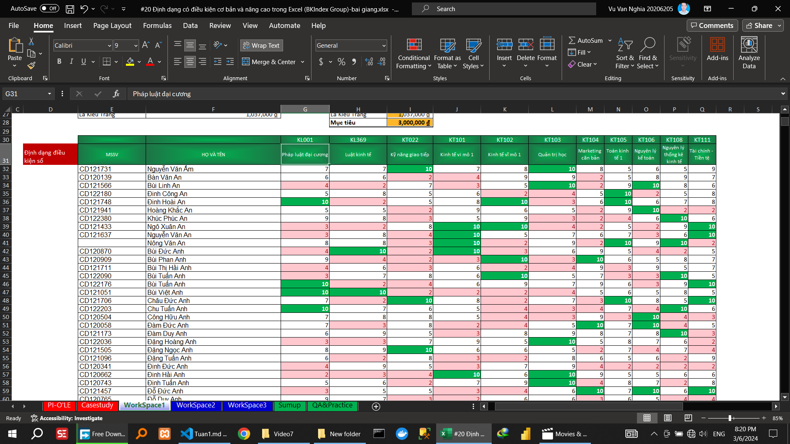

## Video 2

### Hướng dẫn

#### Sắp xếp dữ liệu

##### Sắp xếp dữ liệu theo 1 tiêu chí

##### Sắp xếp dữ liệu theo nhiều tiêu chí

##### Sắp xếp dữ liệu theo giá trị, màu,…

##### Sắp xếp dữ liệu theo yêu cầu đặc thù

#### Lọc dữ liệu

##### Lọc dữ liệu theo một tiêu chí (filter excel)

##### Lọc dữ liệu theo nhiều tiêu chí (filter excel)

##### Lọc dữ liệu nâng cao (filter excel)

### Thực hành
