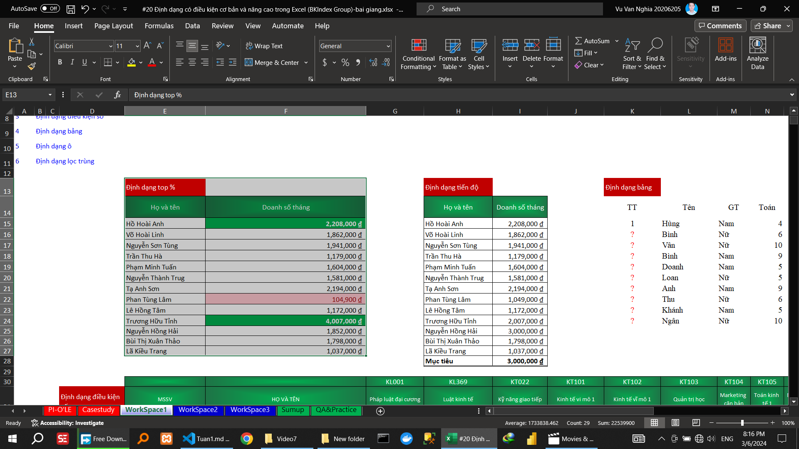

## Video 2

### Hướng dẫn

<!-- #### Sắp xếp dữ liệu  -->

##### Sắp xếp dữ liệu theo một tiêu chí (sort excel)

##### Sắp xếp dữ liệu theo nhiều tiêu chí (filter excel)

##### Sắp sắp dữ liệu nâng cao (sort excel)
<!-- màu -->

SẮP XẾP DỮ LIỆU				
##### Sắp xếp dữ liệu theo 1 tiêu chí			
##### Sắp xếp dữ liệu nhiều tiêu chí			
##### Sắp xếp dữ liệu theo giá trị, màu,…			
##### Sắp xếp dữ liệu theo yêu cầu đặc thù			

<!-- #### Lọc dữ liệu   -->

##### Lọc dữ liệu theo một tiêu chí (filter excel)

##### Lọc dữ liệu theo nhiều tiêu chí (filter excel)

##### Lọc dữ liệu nâng cao (filter excel)

### Thực hành
