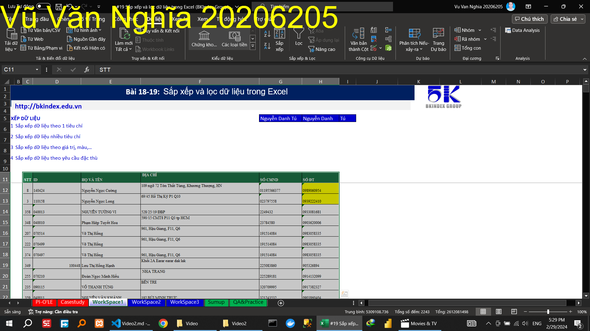
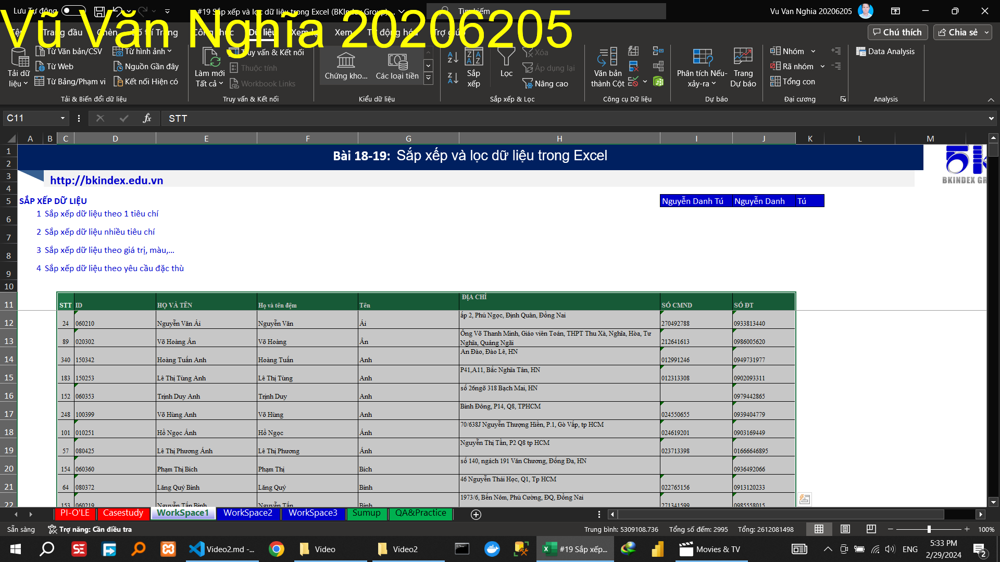

## Video 2

### Hướng dẫn

#### Sắp xếp dữ liệu

##### Sắp xếp dữ liệu theo 1 tiêu chí

##### Sắp xếp dữ liệu theo nhiều tiêu chí

##### Sắp xếp dữ liệu theo giá trị, màu,…

##### Sắp xếp dữ liệu theo yêu cầu đặc thù

#### Lọc dữ liệu

##### Lọc dữ liệu theo 1 tiêu chí

Địa chỉ có chứa HCM

##### Lọc dữ liệu theo nhiều tiêu chí

Sinh tháng 6 và ở HCM

##### Lọc dữ liệu theo yêu cầu đặc thù: control & check

Bổ sung cột để lọc dữ liệu

### Thực hành

<!-- "Bỏ vùng trộn (merge) -->

<!-- Đóng băng tiêu đề dữ liệu" -->

<!-- Sắp xếp dữ liệu theo họ tên -->

<!-- Lọc danh sách nhân viên: -->
<!-- - Nhân viên bộ phận kho -->

<!-- - Nhân viên có mức lương từ 8 dến 10 triệu -->

<!-- - Nhân viên chưa có thông tin CMND -->

<!-- - Nhân viên các xác minh lại hộ khẩu (bôi màu vàng hoặc không có thông tin hộ khẩu) -->

<!-- - Nhân viên bộ phận kho có hộ khẩu tại Hà Nội để lên lịch trực tết -->
