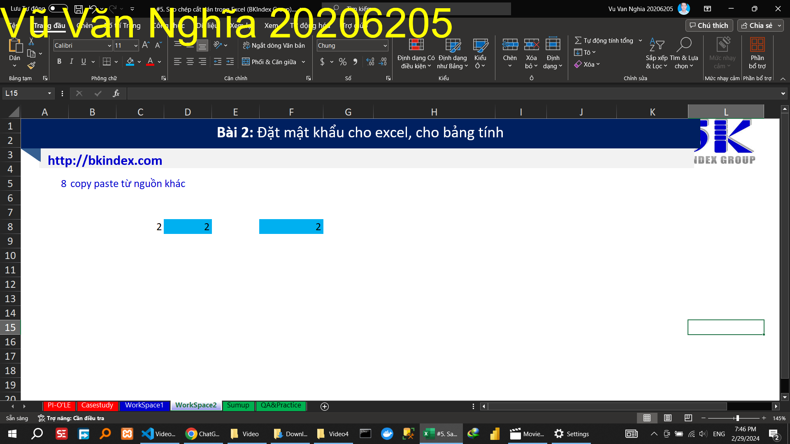

## Video 4

### Hướng dẫn

<!-- - Sao chép thông thường -->
<!-- Sao chép thông thường cột thành tiền -->
<!--  -->
<!-- - Sao chép   theo seri		 -->
<!-- Sao chép   theo seri	số thứ tự  -->
<!--  -->
<!--  -->
<!-- copy paste công thức		 -->
<!-- copy paste định dạng		 -->
<!--  -->
<!-- copy paste giá trị		 -->
<!--  -->
<!-- copy paste ngang->dọc		 -->
<!--  -->
<!-- copy paste dạng ảnh		 -->
<!--  -->
<!-- copy paste từ nguồn khác		 -->

<!-- Trong video này, Bạn sẽ học Excel với các thao tác:
- Sao chép công thức (copy paste formular excel)
- Sao chép định dạng (copy paste format excel)
- Sao chép giá trị (copy paste value excel)
- Xoay bảng sử dụng sao chép (transpose excel)
- Sao chép dữ liệu bảng thành dạng ảnh (copy paste table as picture)
- Sao chép dữ liệu từ nguồn khác *VD:web) vào Excel (copy from other sources to excel)
- paste special in excel
- copy trong excel
- paste trong excel
-  copy and paste in excel
- cách copy trong excel
- paste trong excel chỉ ra định dạng text -->

### Thực hành

Đổi tên tiêu đề và sao chép giá trị, màu sắc

