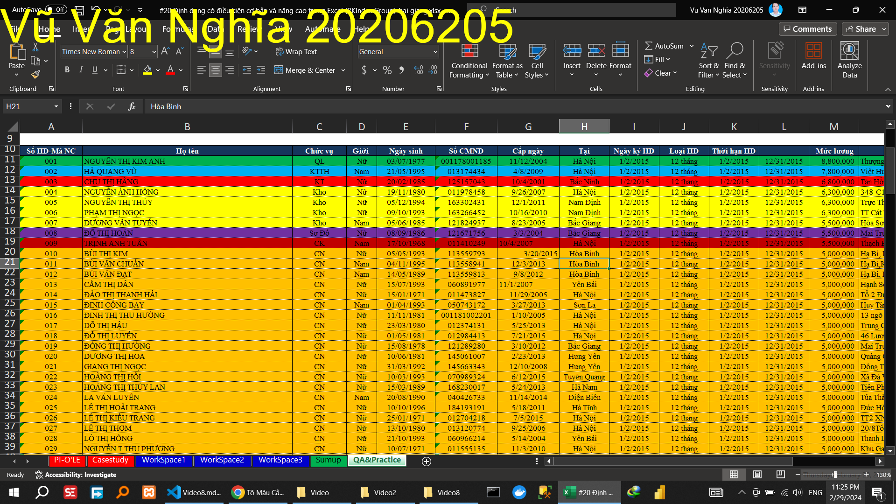
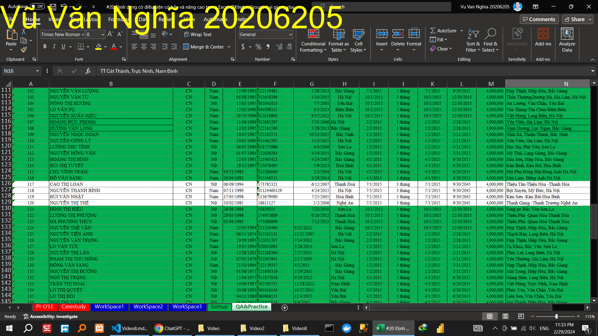
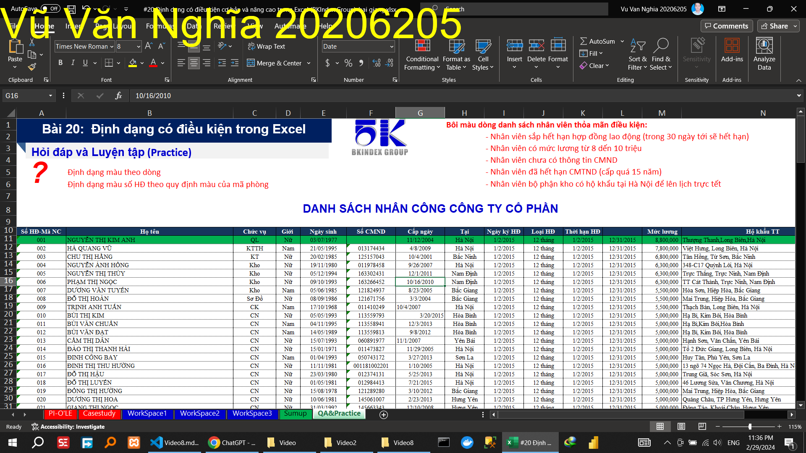
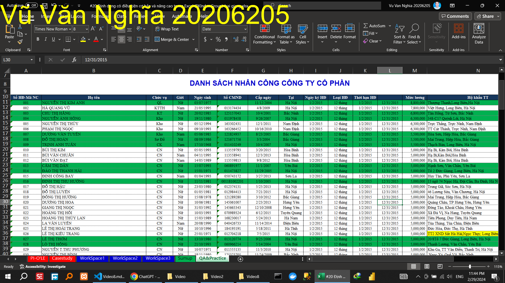

## Video 8

<!-- ### Hướng dẫn -->

### Thực hành

Định dạng màu theo dòng
'=MOD(ROW(C13),2)=1

Định dạng màu số HĐ theo quy định màu của mã phòng

Bôi màu dòng danh sách nhân viên thỏa mãn điều kiện:

<!-- Nhân viên sắp hết hạn hợp đồng lao động (trong 30 ngày tới sẽ hết hạn)					 -->
=$L11-TODAY()<30

<!-- Nhân viên có mức lương từ 8 dến 10 triệu					 -->
=AND($M11>=8000000,$M11<=10000000)

<!-- Nhân viên chưa có thông tin CMND 					 -->
=$F11=""

<!-- Nhân viên đã hết hạn CMTND (cấp quá 15 năm)					 -->
=DATEDIF($G11, TODAY(), "y") > 15

<!-- Nhân viên bộ phận kho có hộ khẩu tại Hà Nội để lên lịch trực tết					 -->

=AND($C11="Kho", $H11="Hà Nội")

