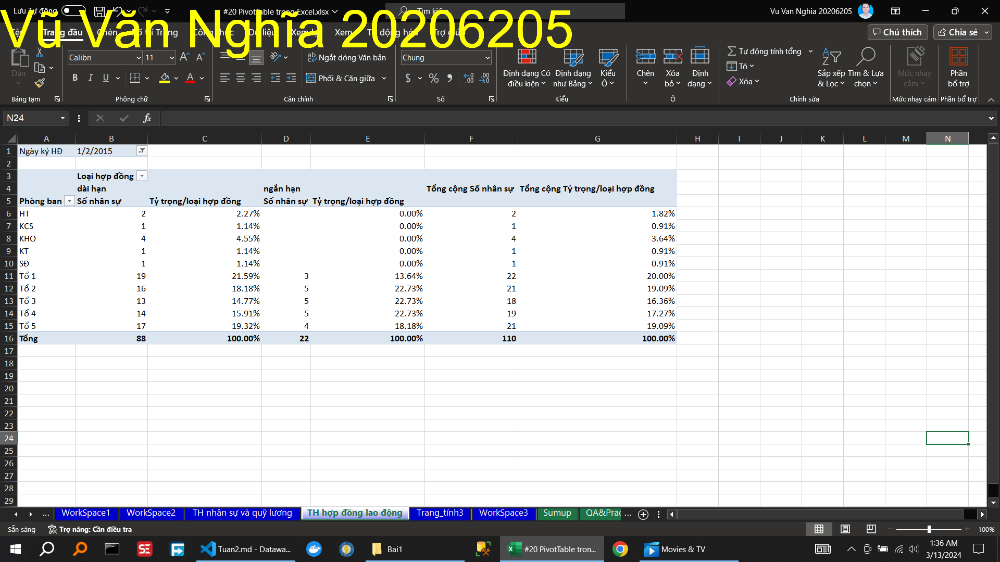
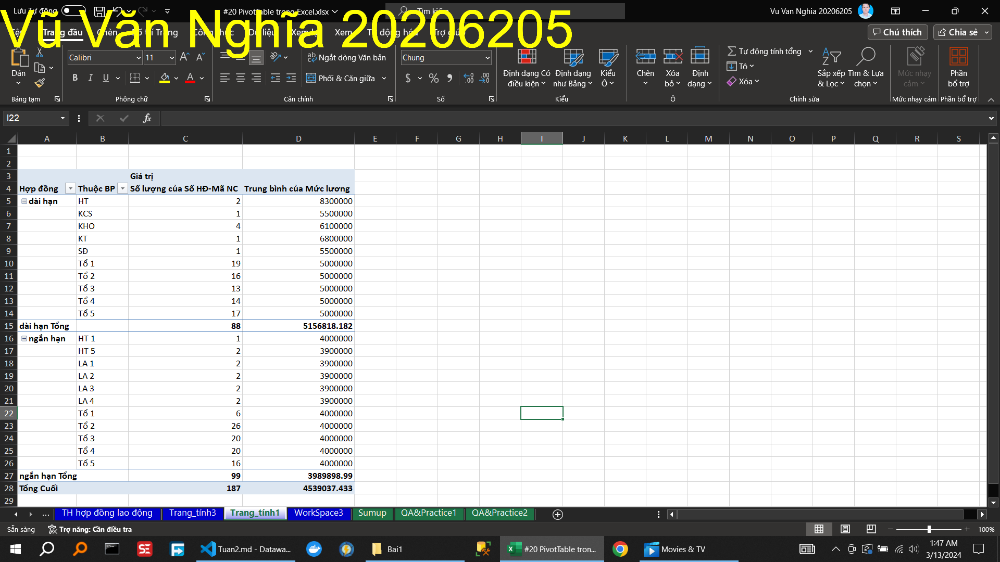
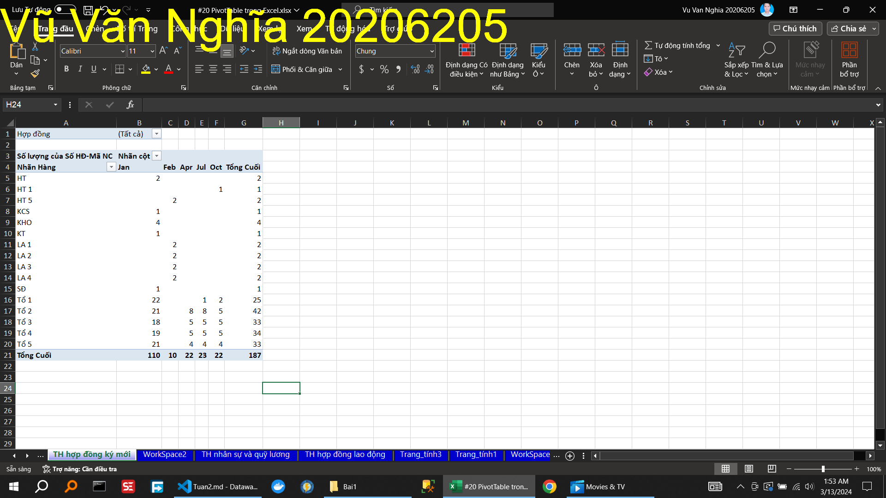
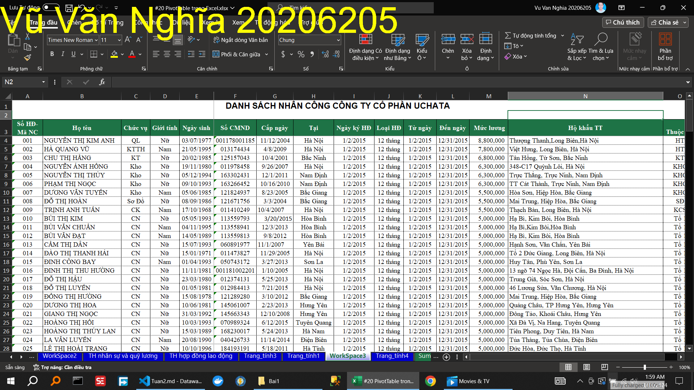
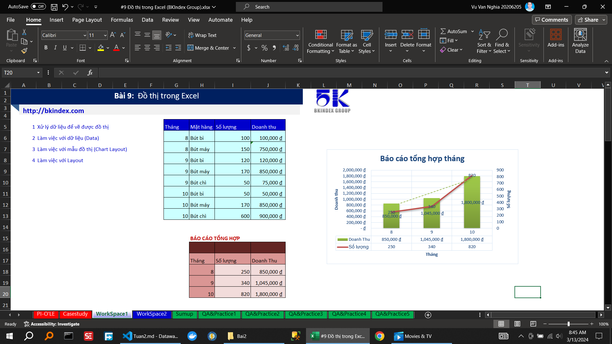

<!--@ \subsection{Bài 1} -->

\caption{Hướng dẫn tạo báo cáo tổng hợp nhân sự và quỹ lương }

\caption{Hướng dẫn tạo báo cáo tổng hợp hợp đồng lao động }

\caption{Hướng dẫn làm mới dữ liệu báo cáo }

\caption{Hướng dẫn lấy dữ liệu chi tiết từ báo cáo }

\caption{Hướng dẫn định dạng dữ liệu trên báo cáo }

\caption{Hướng dẫn thêm các cột/dòng tổng hợp }

\caption{Hướng dẫn tùy chỉnh báo cáo dạng cổ điển}

\caption{Hướng dẫn tùy chỉnh công thức tính }

\caption{Hướng dẫn nhóm các loại dữ liệu (dạng ngày tháng)}

\caption{Hướng dẫn tiền xử lý dữ liệu}

\caption{Thực hành             tiền xử lý dữ liệu}

\caption{Thực hành             tạo báo cáo tổng hợp }

\caption{Thực hành             làm mới dữ liệu báo cáo }

<!--@ \subsection{Bài 2} -->

<!--@ \subsection{Bài 3} -->

\caption{Hướng dẫn xxxxxxxxxxxxxxxxxxxxxx}
\caption{Thực hành xxxxxxxxxxxxxxxxxxxxxx}
