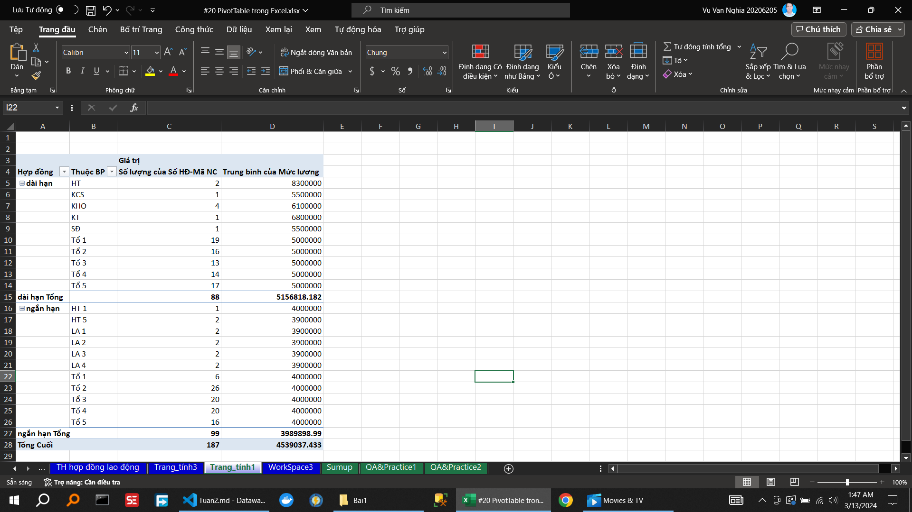

<!--@ \subsection{Bai 1} -->

\caption{Hướng dẫn tạo báo cáo tổng hợp nhân sự và quỹ lương }

\caption{Hướng dẫn tạo báo cáo tổng hợp hợp đồng lao động }

\caption{Hướng dẫn làm mới dữ liệu báo cáo }

\caption{Hướng dẫn lấy dữ liệu chi tiết từ báo cáo  }

\caption{Hướng dẫn  định dạng dữ liệu trên   báo cáo  }

\caption{Hướng dẫn  thêm các cột/dòng tổng hợp }

\caption{Hướng dẫn  tùy chỉnh báo cáo dạng cổ điển}

\caption{Hướng dẫn  tùy chỉnh công thức tính }

\caption{Hướng dẫn nhóm các loại dữ liệu (dạng ngày tháng)}

\caption{Hướng dẫn xxxxxxxxxxxxxxxxxxxxxx}

\caption{Hướng dẫn xxxxxxxxxxxxxxxxxxxxxx}

\caption{Hướng dẫn xxxxxxxxxxxxxxxxxxxxxx}

\caption{Hướng dẫn xxxxxxxxxxxxxxxxxxxxxx}

<!-- II	Nâng cao và thực tiễn	 -->
<!-- 9		Tiền xử lý dữ liệu -->
<!-- 10		Bổ sung các cột dữ liệu để làm báo cáo tổng hợp -->
<!-- 11		Các tầng dữ liệu -->

<!--@ \subsection{Bai 2} -->

<!--@ \subsection{Bai 3} -->
\caption{Hướng dẫn xxxxxxxxxxxxxxxxxxxxxx}
