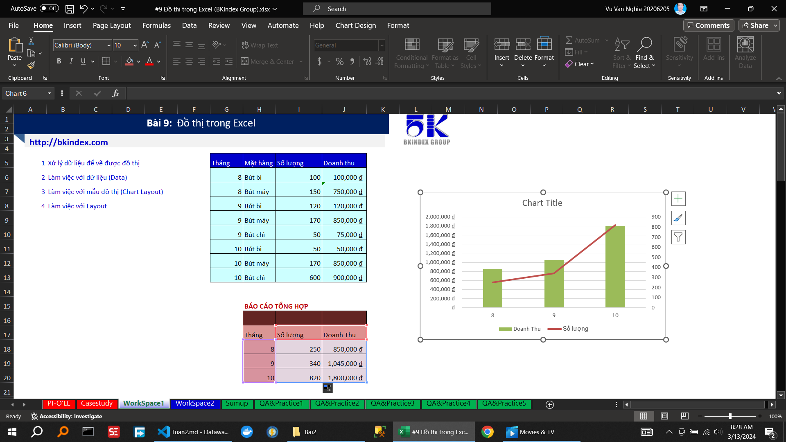

<!--@ \subsection{Bài 2} -->
<!--                   Xử lý dữ liệu để vẽ được đồ thị                                                       -->

<!--                   Làm việc với dữ liệu (Data)                                                       -->

<!--                   Làm việc với mẫu đồ thị (Chart Layout)                                                       -->

<!--                   Làm việc với Layout                                                       -->

<!--@ \subsection{Bài 3} -->

\caption{Hướng dẫn xxxxxxxxxxxxxxxxxxxxxx}
\caption{Thực hành xxxxxxxxxxxxxxxxxxxxxx}
