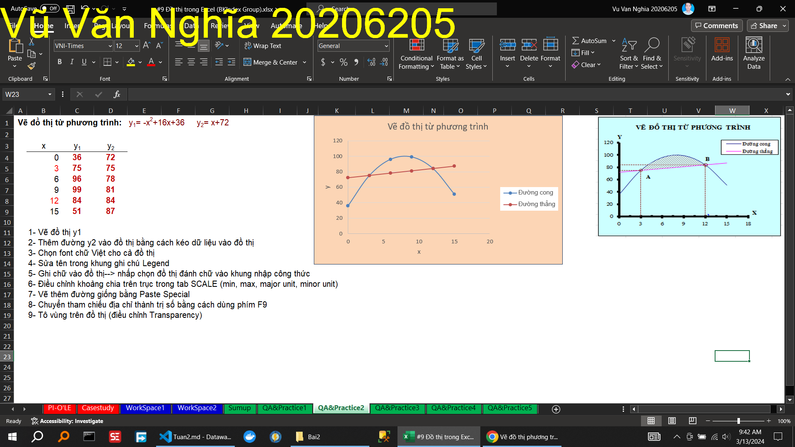

\subsection{Bài 2}

\caption{Hướng dẫn xử lý dữ liệu để vẽ được đồ thị }

\caption{Hướng dẫn vẽ được đồ thị với dữ liệu}

\caption{Hướng dẫn làm việc với mẫu đồ thị (Chart Layout)}

\caption{Hướng dẫn làm việc với Layout}

\caption{Hướng dẫn làm đồ thị trong 60s (với Pilot Table)}

\caption{Thực hành vẽ đồ thị giao nhau}

\caption{Thực hành vẽ đồ thị tần suất và tích lũy}

\caption{Thực hành vẽ đồ thị hình bánh}

\caption{Thực hành vẽ đồ thị hình bánh của hình bánh}

<!--@ \subsection{Bài 3} -->

\caption{Hướng dẫn xxxxxxxxxxxxxxxxxxxxxx}
\caption{Thực hành xxxxxxxxxxxxxxxxxxxxxx}
