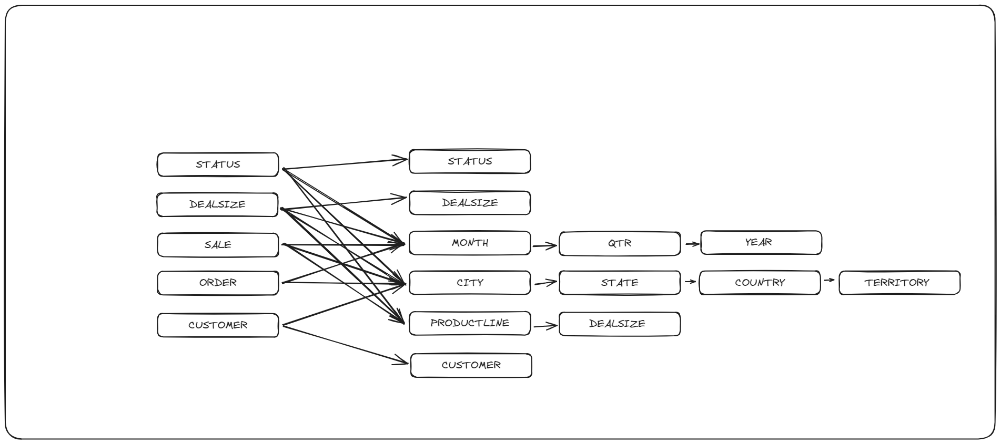
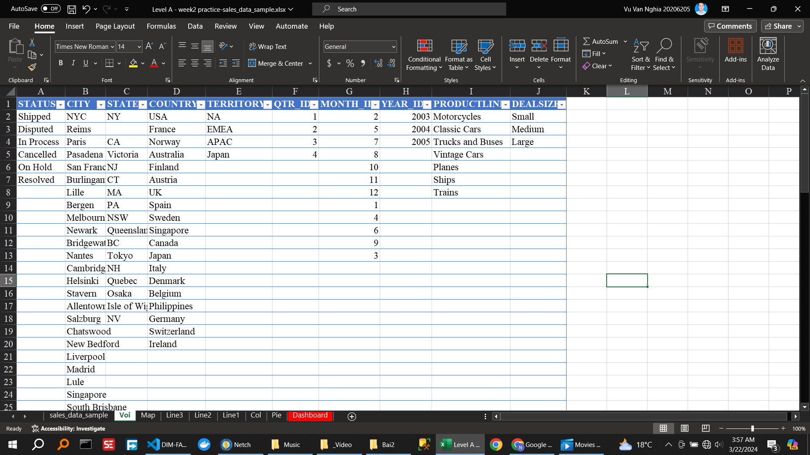
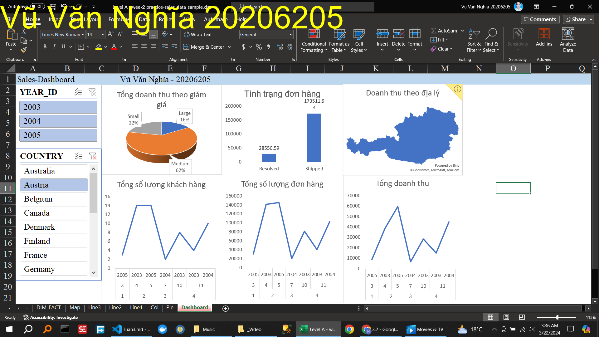

<!-- 🍀 2. Viết Requirement cần phân tích -->

Các yêu cầu phân tích:

Tổng doanh thu theo giảm giá
Tình trạng đơn hàng
Doanh thu theo địa lý
Tổng số lượng đơn hàng
Tổng số lượng khách hàng
Tổng số lượng đơn hàng

<!-- 🍀 3. Xác định các DIM, FACT -->

<!-- 🍀 4. Vẽ voi DIM -->

<!-- 🍀 5. Xây dựng một dashboard trên dữ liệu này theo requirement. -->

<!-- 🍀 6. Phân tích trên dashboard vừa xây dựng. -->

Dashboard hiển thị nhiều dữ liệu hữu ích: tổng doanh số bán hàng của công ty mỗi năm từ 2003-2005, có thể lọc theo tháng và quốc gia.

Doanh số của size trung bình là lớn nhất.

Ta thấy qua các năm, doanh số tăng nhẹ, điều này là do cuộc sống ngày càng đi lên nên nhu cầu tăng thêm.
