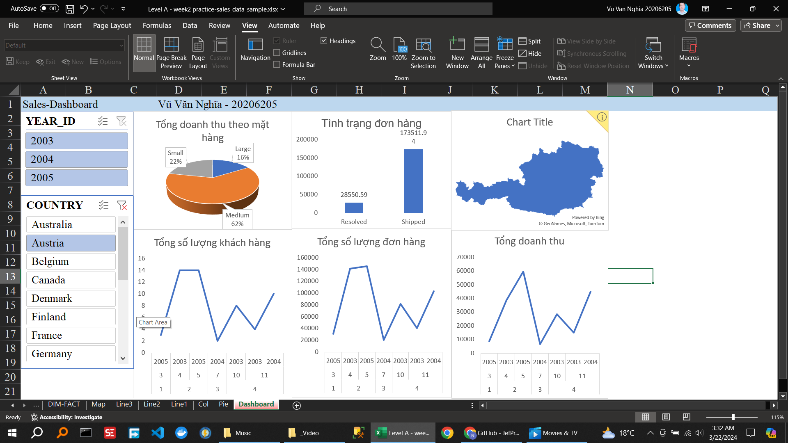

<!-- 🍀 2. Viết Requirement cần phân tích -->

xxxxxxxxxxxxxxx

<!-- 🍀 3. Xác định các DIM, FACT -->

từ hình suy ra 1

<!-- 🍀 4. Vẽ voi DIM -->

xem thêm 2

<!-- 🍀 5. Xây dựng một dashboard trên dữ liệu này theo requirement. -->

<!-- 🍀 6. Phân tích trên dashboard vừa xây dựng. -->

pt... 4
<!--  -->

- QUANTITYORDERED: SỐ LƯỢNG ĐẶT HÀNG
- PRICEEACH: GIÁ MỖI
- ORDERLINENUMBER: SỐ ĐẶT HÀNG
<!-- - SALES: VIỆC BÁN HÀNG -->
<!-- - : DÒNG SẢN PHẨM -->
- MSRP: MSRP
- PRODUCTCODE: MÃ SẢN PHẨM
- CUSTOMERNAME: TÊN KHÁCH HÀNG
 

<!--  -->
Về
Trang tổng quan này đã được tạo bằng cách sử dụng mẫu dữ liệu bán hàng trên Kaggle. Bảng điều khiển hiển thị nhiều dữ liệu hữu ích: tổng doanh số bán hàng của công ty mỗi năm từ 2003-2005, có thể lọc theo tháng và quốc gia. Bảng điều khiển cũng hiển thị dữ liệu tăng trưởng doanh số hàng năm dựa trên các tiêu chí khác nhau bao gồm tháng, sản phẩm và khu vực.
<!--  -->
<!-- QTR, MONTH, YEAR -->
<!-- CITY, STATE, COUNTRY, TERRITORY -->
<!-- PRODUCTLINE, DEALSIZE -->
STATUS

<!--  -->
<!--  -->
Lọc Năm
Lọc Vị trí

<!-- Tổng đơn hàng -->
<!-- Tổng khách hàng -->
<!-- Tổng doanh thu -->

Tình trạng đơn hàng

Tổng doanh thu theo bản đồ

Tổng doanh thu theo mặt hàng
