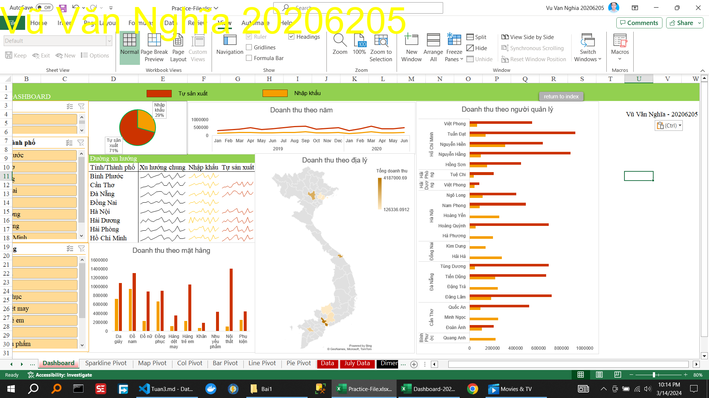

<!--@ \subsection{Bài 1} -->
\caption{Thực hành tạo Dashboard theo video}

<!-- \caption{Thực hành phân tích  Dashboard } -->

Thời gian	Năm	Loại hình Sản xuất	Tỉnh/Thành phố	Nước	Quản lý	Mặt hàng	Khách hàng	Doanh số(Triệu)

<!-- PHÂN TÍCH -->
<!-- B1. Đọc dashboard, phân tích  -->
<!-- B2. Xác định các chiều (DIM), các các yếu tố phân tích (FACT) -->
<!-- B3. Sử dụng công cụ Remove Duplicate để tạo ra con voi khái niệm các chiều. -->

<!--@ \subsection{Bài 2} -->
\caption{Hướng dẫn xxxxxxxxxxxxxxxxxxxxxx}
\caption{Thực hành xxxxxxxxxxxxxxxxxxxxxx}
