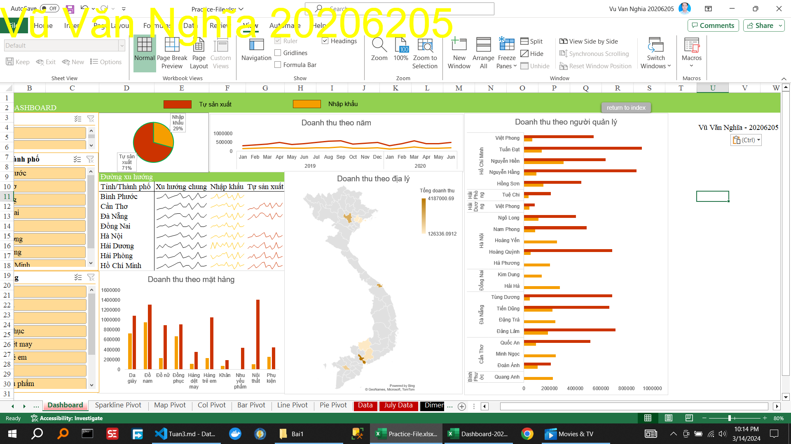

<!--@ \subsection{Bài 1} -->
\caption{Thực hành tạo Dashboard theo video}

Thời gian	Năm	Loại hình Sản xuất	Tỉnh/Thành phố	Nước	Quản lý	Mặt hàng	Khách hàng	Doanh số(Triệu)
<!-- \caption{Thực hành phân tích  Dashboard } -->
<!-- B1. Đọc dashboard, phân tích  -->
Dashboard dùng để
Dashboard có các biểu đồ:
...

<!-- B2. Xác định các chiều (DIM), các các yếu tố phân tích (FACT) -->
ảnh ...

text...

Bước 2: Xác định Các Chiều (DIM) và Các Yếu Tố Phân Tích (FACT)
Xác định các chiều (DIM) là các khía cạnh của dữ liệu bạn muốn phân tích. Ví dụ: Thời gian, Năm, Loại hình Sản xuất, Tỉnh/Thành phố, Nước, Quản lý, Mặt hàng, Khách hàng.
Xác định các yếu tố phân tích (FACT) là các dữ liệu số hoặc thông tin mà bạn muốn phân tích. Ví dụ: Doanh số (Triệu).
<!-- B3. Sử dụng công cụ Remove Duplicate để tạo ra con voi khái niệm các chiều. -->

<!--@ \subsection{Bài 2} -->
\caption{Hướng dẫn xxxxxxxxxxxxxxxxxxxxxx}
\caption{Thực hành xxxxxxxxxxxxxxxxxxxxxx}
